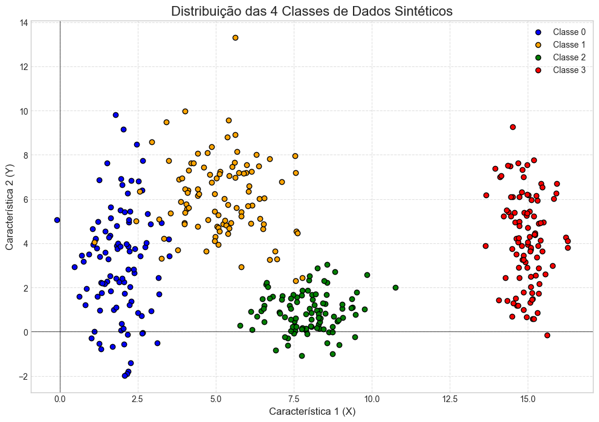
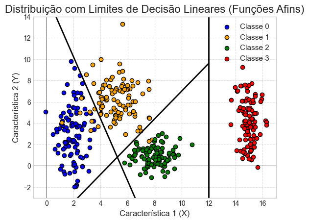
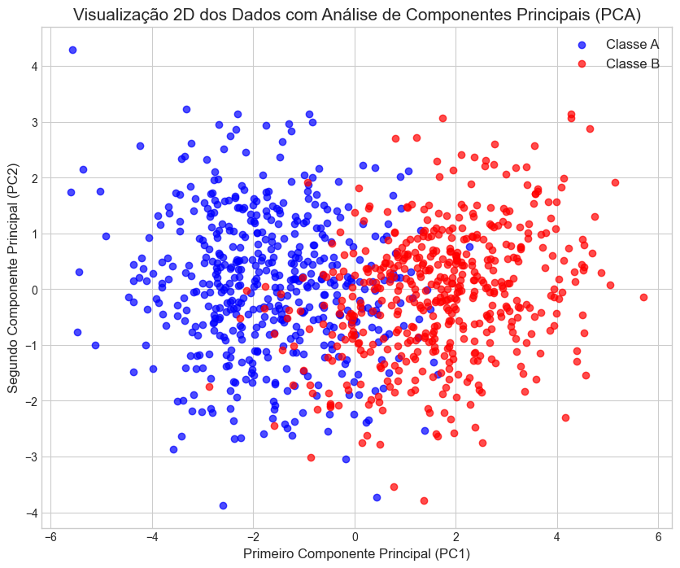
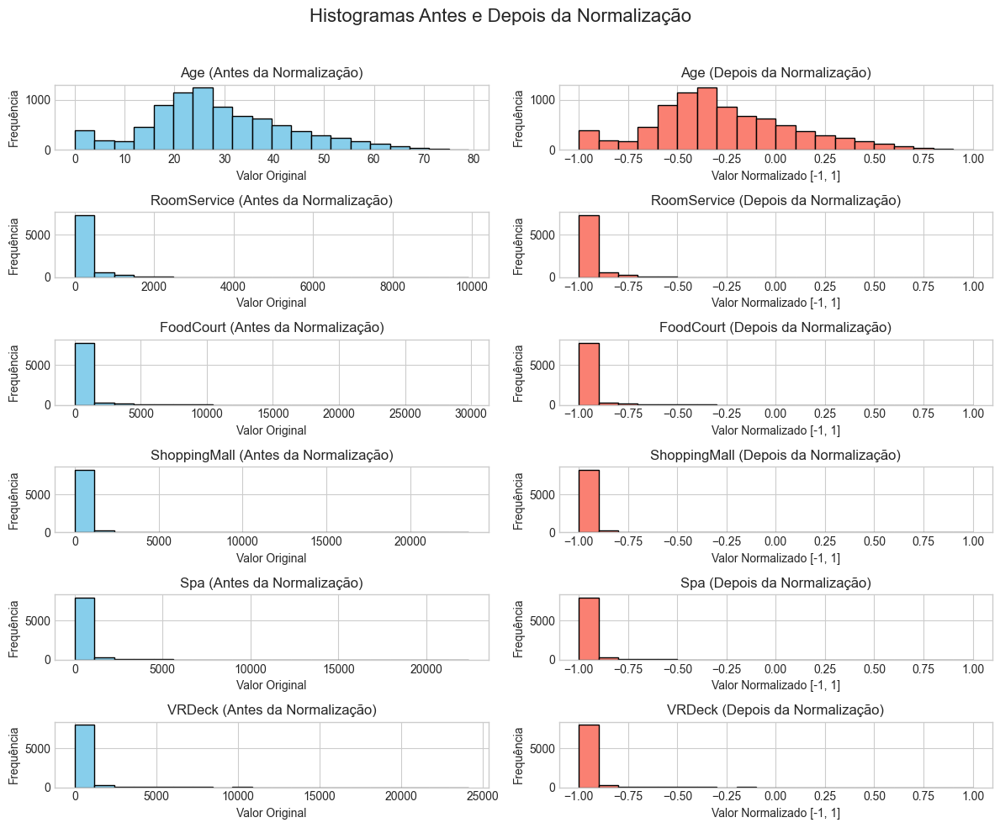

# Redes Neurais


???+ info inline end "Edição"

    2025.1


## Erik Soares

## Exercício 1

### Explorando a Separabilidade de Classes em 2D

#### Instruções

1.  **Gerar os Dados:** Crie um conjunto de dados sintético com um total de 400 amostras, divididas igualmente entre 4 classes (100 amostras cada). Utilize uma distribuição Gaussiana para gerar os pontos para cada classe com base nos seguintes parâmetros:
    *   Classe 0: Média = [2, 3], Desvio Padrão = [0.8, 2.5]
    *   Classe 1: Média = [5, 6], Desvio Padrão = [1.2, 1.9]
    *   Classe 2: Média = [8, 1], Desvio Padrão = [0.9, 0.9]
    *   Classe 3: Média = [15, 4], Desvio Padrão = [0.5, 2.0]

2.  **Plotar os Dados:** Crie um gráfico de dispersão 2D mostrando todos os pontos de dados. Utilize uma cor diferente para cada classe para torná-las distinguíveis.

3.  **Analisar e Desenhar Limites:** 
- Examine o gráfico de dispersão com atenção. Descreva a distribuição e a sobreposição das quatro classes.
- Com base na sua inspeção visual, um limite simples e linear poderia separar todas as classes?
- Em seu gráfico, esboce os limites de decisão que você acha que uma rede neural treinada poderia aprender para separar essas classes.

#### Solução

##### Geração e Plotagem dos Dados

O código abaixo gera os dados sintéticos conforme as especificações e os plota em um gráfico de dispersão 2D.

```python
import numpy as np
import matplotlib.pyplot as plt

np.random.seed(42)

params = {
    'classe_0': {'media': [2, 3], 'desvio_padrao': [0.8, 2.5], 'n_amostras': 100},
    'classe_1': {'media': [5, 6], 'desvio_padrao': [1.2, 1.9], 'n_amostras': 100},
    'classe_2': {'media': [8, 1], 'desvio_padrao': [0.9, 0.9], 'n_amostras': 100},
    'classe_3': {'media': [15, 4], 'desvio_padrao': [0.5, 2.0], 'n_amostras': 100}
}

X = []
y = []

for i, (classe, p) in enumerate(params.items()):
    dados_classe = np.random.normal(
        loc=p['media'],
        scale=p['desvio_padrao'],
        size=(p['n_amostras'], 2),
    )
    
    X.append(dados_classe)
    y.append(np.full(p['n_amostras'], fill_value=i))

X = np.concatenate(X)
y = np.concatenate(y)

plt.figure(figsize=(12, 8))

cores = ['blue', 'orange', 'green', 'red']
labels_classes = ['Classe 0', 'Classe 1', 'Classe 2', 'Classe 3']

for i in range(4):
    plt.scatter(
        X[y == i, 0],
        X[y == i, 1],
        c=cores[i],
        label=labels_classes[i],
        edgecolors='k'
    )


plt.title('Distribuição das 4 Classes de Dados Sintéticos', fontsize=16)
plt.xlabel('Característica 1 (X)', fontsize=12)
plt.ylabel('Característica 2 (Y)', fontsize=12)
plt.legend(fontsize=10)
plt.grid(True, linestyle='--', alpha=0.6)
plt.axhline(0, color='black', linewidth=0.5)
plt.axvline(0, color='black', linewidth=0.5)
plt.show()
```




##### Análise e Limites de Decisão

Após a execução do código acima, será gerado um gráfico de dispersão. A análise visual do gráfico revela:

*   **Classe 0:** A classe 0 é a classe que apresenta os dados mais dispersos, principalmente em relação a característica 2 (Y), alguns dados se aproximam e se misturam com dados da classe 1.
*   **Classe 1:** A classe 1 está localizada acima e a direita da classe 1, mas não tão distante, o que permite uma mistura considerável de seus dados, além disso, poucos dados ainda conseguem se misturar com a classe 2. Essa classe também apresenta uma certa dispersão, em relação ao componente 1 e 2, mas ainda menor que a classe 1.
*   **Classe 2:** A classe dois está localizada a direita da classe 0 e 1, e um pouco para baixo, ela está mais afastada e por isso tem uma mistura mínima com as outras classes. É uma classe com uma dispersão bem baixa em relação a ambos os componentes.
*   **Classe 3:** A classe 3 é a classe mais isolada, nenhum de seus dados se misturam com outras classes, está totalmente à direita. Sua dispersão é predominantemente em relação a característica 2 (Y).

As classes 0, 1 e 2 parecem ser razoavelmente separáveis linearmente, embora possa haver alguma sobreposição entre elas. A Classe 3 está bem distante das outras, indicando uma alta separabilidade. Portanto, um limite simples e linear não é capaz de separar adequadamente todas as classes, pois há classes que se misturam, e até mesmo pontos de classes diferentes que estão praticamente um sob o outro.

##### Simulação dos limites de decisão

O código abaixo esboça os limites de decisão lineares que tenta separar as classes:
```python
import numpy as np
import matplotlib.pyplot as plt

np.random.seed(42)

params = {
    'classe_0': {'media': [2, 3], 'desvio_padrao': [0.8, 2.5], 'n_amostras': 100},
    'classe_1': {'media': [5, 6], 'desvio_padrao': [1.2, 1.9], 'n_amostras': 100},
    'classe_2': {'media': [8, 1], 'desvio_padrao': [0.9, 0.9], 'n_amostras': 100},
    'classe_3': {'media': [15, 4], 'desvio_padrao': [0.5, 2.0], 'n_amostras': 100}
}

X = []
y = []

for i, (classe, p) in enumerate(params.items()):
    dados_classe = np.random.normal(
        loc=p['media'],
        scale=p['desvio_padrao'],
        size=(p['n_amostras'], 2),
    )
    
    X.append(dados_classe)
    y.append(np.full(p['n_amostras'], fill_value=i))

X = np.concatenate(X)
y = np.concatenate(y)

x_line1 = np.array([0, 12])
y_line1 = -2.9 * x_line1 + 16
plt.plot(x_line1, y_line1, '-', color='k', lw=2)


x_line2 = np.array([2, 12])
y_line2 = 1.3 * x_line2 - 6
plt.plot(x_line2, y_line2, '-', color='k', lw=2)

plt.axvline(x=12, linestyle='-', color='k', lw=2)

for i in range(4):
    plt.scatter(
        X[y == i, 0], X[y == i, 1], 
        color=cores[i], 
        edgecolors='k', 
        label=labels_classes[i],
    )
plt.title('Distribuição com Limites de Decisão Lineares (Funções Afins)', fontsize=16)
plt.xlabel('Característica 1 (X)', fontsize=12)
plt.ylabel('Característica 2 (Y)', fontsize=12)
plt.legend(fontsize=11)
plt.grid(True, linestyle='--', alpha=0.7)
plt.axhline(0, color='black', linewidth=0.5)
plt.axvline(0, color='black', linewidth=0.5)

plt.xlim(-1, 17)
plt.ylim(-3, 14)

plt.show()
```



## Exercício 2

### Não Linearidade em Dimensões Superiores

#### Instruções

Redes neurais simples (como um Perceptron) só podem aprender limites lineares. Redes profundas se destacam quando os dados não são linearmente separáveis. Este exercício desafia você a criar e visualizar um conjunto de dados não linearmente separável.

1.  **Gerar os Dados:** Crie um conjunto de dados com 500 amostras para a Classe A e 500 amostras para a Classe B. Utilize uma distribuição normal multivariada com os seguintes parâmetros:

    *   **Classe A:**
        *   Vetor médio: 
            ```
            μ_A = [0, 0, 0, 0, 0]
            ```
        *   Matriz de covariância:
            ```
            Σ_A = [[1.0, 0.8, 0.1, 0.0, 0.0],
                   [0.8, 1.0, 0.3, 0.0, 0.0],
                   [0.1, 0.3, 1.0, 0.5, 0.0],
                   [0.0, 0.0, 0.5, 1.0, 0.2],
                   [0.0, 0.0, 0.0, 0.2, 1.0]]
            ```

    *   **Classe B:**
        *   Vetor médio: 
            ```
            μ_B = [1.5, 1.5, 1.5, 1.5, 1.5]
            ```
        *   Matriz de covariância:
            ```
            Σ_B = [[1.5, -0.7, 0.2, 0.0, 0.0],
                   [-0.7, 1.5, 0.4, 0.0, 0.0],
                   [0.2, 0.4, 1.5, 0.6, 0.0],
                   [0.0, 0.0, 0.6, 1.5, 0.3],
                   [0.0, 0.0, 0.0, 0.3, 1.5]]
            ```

2.  **Redução de Dimensionalidade (PCA):** 
- Como os dados estão em 5 dimensões, utilize a Análise de Componentes Principais (PCA) para reduzir a dimensionalidade para 2 componentes principais. Isso permitirá a visualização.

- Crie um gráfico de dispersão 2D dos dados transformados pela PCA. Utilize uma cor diferente para cada classe.

3.  **Analisar a Separabilidade:** Com base no gráfico de dispersão, discuta se as classes são linearmente separáveis em 2D. Explique por que a não linearidade é importante para redes neurais profundas neste contexto.

#### Solução

##### Geração de Dados e Redução de Dimensionalidade

O código abaixo gera os dados para as Classes A e B, e então aplica PCA para reduzir a dimensionalidade para 2D.

```python
import numpy as np
import matplotlib.pyplot as plt
from sklearn.decomposition import PCA

np.random.seed(42)

jn_amostras_A= 500
n_amostras_B = 500

media_A = np.array([0, 0, 0, 0, 0])
media_B = np.array([1.5, 1.5, 1.5, 1.5, 1.5])

covariancia_A = np.array([
    [1.0, 0.8, 0.1, 0.0, 0.0],
    [0.8, 1.0, 0.3, 0.0, 0.0],
    [0.1, 0.3, 1.0, 0.5, 0.0],
    [0.0, 0.0, 0.5, 1.0, 0.2],
    [0.0, 0.0, 0.0, 0.2, 1.0]
])

covariancia_B = np.array([
    [1.5, -0.7, 0.2, 0.0, 0.0],
    [-0.7, 1.5, 0.4, 0.0, 0.0],
    [0.2, 0.4, 1.5, 0.6, 0.0],
    [0.0, 0.0, 0.6, 1.5, 0.3],
    [0.0, 0.0, 0.0, 0.3, 1.5]
])

X = np.vstack((dados_A, dados_B))
y = np.hstack((np.zeros(dados_A.shape[0]), np.ones(dados_B.shape[0])))

pca = PCA(n_components=2)

dados_2D = pca.fit_transform(X)


plt.style.use('seaborn-v0_8-whitegrid')
plt.figure(figsize=(10, 8))

plt.scatter(
    dados_2D[y == 0, 0],
    dados_2D[y == 0, 1],  
    c='blue',
    label='Classe A',
    alpha=0.7
)

plt.scatter(
    dados_2D[y == 1, 0],
    dados_2D[y == 1, 1],
    c='red',
    label='Classe B',
    alpha=0.7
)

plt.title('Visualização 2D dos Dados com Análise de Componentes Principais (PCA)', fontsize=15)
plt.xlabel('Primeiro Componente Principal (PC1)', fontsize=12)
plt.ylabel('Segundo Componente Principal (PC2)', fontsize=12)
plt.legend(fontsize=12)
plt.show()
```



##### Análise da Separabilidade

Ao observar o gráfico gerado, é evidente que as duas classes (A e B) se sobrepõem significativamente no espaço 2D após a redução de dimensionalidade via PCA. Isso indica que os dados **não são linearmente separáveis** neste espaço. Uma única linha reta não seria capaz de dividir as duas classes de forma eficaz.

**Importância da Não Linearidade para Redes Neurais Profundas:**

*   **Perceptrons Simples:** Um Perceptron simples é um classificador linear. Ele só pode aprender limites de decisão que são linhas (em 2D), planos (em 3D) ou hiperplanos (em dimensões superiores). Se os dados não são linearmente separáveis, um Perceptron simples não conseguirá classificá-los corretamente.

*   **Redes Neurais Profundas:** Redes neurais profundas, com suas múltiplas camadas ocultas e funções de ativação não lineares, são capazes de aprender e modelar relações complexas e não lineares nos dados. Cada camada oculta pode transformar os dados em uma nova representação, onde as classes podem se tornar linearmente separáveis. As funções de ativação não lineares (como ReLU, sigmoid, tanh) são cruciais para essa capacidade, pois introduzem a não linearidade necessária para aprender limites de decisão complexos e curvos.

Neste exercício, a sobreposição das classes no espaço 2D demonstra a necessidade de um modelo mais complexo do que um classificador linear. Redes neurais profundas, com sua arquitetura multicamadas e não linearidades, são ideais para lidar com esse tipo de problema, permitindo a identificação de padrões e a separação de classes que não são trivialmente distinguíveis por uma fronteira linear.


## Exercício 3

### Preparando Dados do Mundo Real para uma Rede Neural

#### Instruções

Este exercício utiliza um conjunto de dados real do Kaggle. Sua tarefa é realizar o pré-processamento necessário para torná-lo adequado para uma rede neural que utiliza a tanhfunção de ativação tangente hiperbólica ( ) em suas camadas ocultas.

1.  **Obtenha os Dados:** baixe o conjunto de dados da nave espacial Titanic do Kaggle.
2.  **Descreva os dados:** 
- Descreva brevemente o objetivo do conjunto de dados (ou seja, o que a Transportedcoluna representa?).
- Liste as características e identifique quais são numéricas (por exemplo, Age, RoomService) e quais são categóricas (por exemplo, HomePlanet, Destination).
- Investigue o conjunto de dados em busca de valores ausentes . Quais colunas os contêm e quantos?
3.  **Pré-processar os Dados:** Seu objetivo é limpar e transformar os dados para que possam ser alimentados em uma rede neural. A tanhfunção de ativação produz saídas no intervalo [-1, 1], portanto, seus dados de entrada devem ser dimensionados adequadamente para um treinamento estável.
    *   Tratamento de valores ausentes (ex: imputação, remoção).
    *   Codificação de features categóricas (ex: one-hot encoding, label encoding).
    *   Escalonamento de features (ex: MinMaxScaler, StandardScaler).
4.  **Visualize os resultados:** Crie histogramas para um ou dois recursos numéricos (como FoodCourtou Age) antes e depois do dimensionamento para mostrar o efeito da sua transformação.

#### Solução

##### Carregamento, exploração e tratamento dos dados

O código abaixo é responsável por carregar, explorar os dados, e tratar tudo o que for necessário para a utilização de um modelo de rede neural.

```python
import numpy as np
import matplotlib.pyplot as plt
import pandas as pd
from sklearn.decomposition import PCA
from sklearn.preprocessing import MinMaxScaler

np.random.seed(42)

# Carregar o dataset
df = pd.read_csv("./spaceship-titanic/train.csv")

contagem_nulos = df.isnull().sum()
print(f'Nulos: {contagem_nulos}')
print(df.describe())

# Tratamento de valores nulos:

df['HomePlanet'] = df['HomePlanet'].fillna('Earth') # Foi preenchido com Earth pois é o valor predominante (54%)

df['CryoSleep'] = df['CryoSleep'].fillna(False) # Foi preenchido com False pois é o valor predominante (64%)

df = df.dropna(subset=['Cabin']) # Remove os nulos de cabin, pois não há predominância de um valor que possa ser embutido e que não prejudique a análise, como média, mediana, etc.
# Além disso, 199 não é uma quantidade significativa para nosso tamanho de dataset

df[['cabin_deck', 'cabin_num', 'cabin_side']] = df['Cabin'].str.split('/', expand=True)
df = df.drop(columns=['Cabin'])

df['Destination'] = df['Destination'].fillna('TRAPPIST-1e') # TRAPPIST-1e representa 69% dos dados, podemos utilizá-lo para preencher os nulos

mediana_age = df['Age'].median()
df['Age'] = df['Age'].fillna(mediana_age) # Preenchemos com a mediana para sermos resistentes à outliers

df['VIP'] = df['VIP'].fillna(False) # Os não VIPS representam 97% do dataset.

# Os valores utilizados no preenchimento representam cerca de 60% ou mais das linhas, é melhor do que pegarmos a média.
df['RoomService'] = df['RoomService'].fillna(0)
df['FoodCourt'] = df['FoodCourt'].fillna(0)
df['ShoppingMall'] = df['ShoppingMall'].fillna(0)
df['Spa'] = df['Spa'].fillna(0)
df['VRDeck'] = df['VRDeck'].fillna(0)

# Como a coluna Name não será utilizada pelo nosso modelo por não conter nenhuma informação relevante podemos manter os registros, e apenas apagar a coluna futuramente.

# Transformando dados categóricos em valores 0 e 1:
df = pd.get_dummies(df, columns=['HomePlanet', 'Destination', 'cabin_deck', 'cabin_side'])
colunas_booleanas = df.select_dtypes(include=['bool', 'boolean']).columns
for coluna in colunas_booleanas:
    df[coluna] = df[coluna].astype('Int64')
df = df.drop(columns=['PassengerId', 'Name'])

# Utilizando MinMaxScaler para manter os dados em uma escala de -1 a 1:
scaler = MinMaxScaler(feature_range=(-1, 1))
colunas_numericas = df.select_dtypes(include=np.number).columns
df_normalizado = df.copy()
df_normalizado[colunas_numericas] = scaler.fit_transform(df_normalizado[colunas_numericas])


colunas_para_visualizar = ['Age', 'RoomService', 'FoodCourt', 'ShoppingMall', 'Spa', 'VRDeck']

fig, axes = plt.subplots(nrows=len(colunas_para_visualizar), ncols=2, figsize=(12, 10))

fig.suptitle('Histogramas Antes e Depois da Normalização', fontsize=16)

for i, col in enumerate(colunas_para_visualizar):
    # Plotar o histograma dos dados originais ("Antes")
    axes[i, 0].hist(df[col], bins=20, color='skyblue', edgecolor='black')
    axes[i, 0].set_title(f'{col} (Antes da Normalização)')
    axes[i, 0].set_xlabel('Valor Original')
    axes[i, 0].set_ylabel('Frequência')

    # Plotar o histograma dos dados normalizados ("Depois")
    axes[i, 1].hist(df_normalizado[col], bins=20, color='salmon', edgecolor='black')
    axes[i, 1].set_title(f'{col} (Depois da Normalização)')
    axes[i, 1].set_xlabel('Valor Normalizado [-1, 1]')
    axes[i, 1].set_ylabel('Frequência')

plt.tight_layout(rect=[0, 0, 1, 0.96])

plt.show()
```

##### Pré-processamento dos Dados e Justificativa das Escolhas

Para preparar os dados para uma rede neural, aplicamos as seguintes etapas de pré-processamento:

1.  **Tratamento de Valores Ausentes:**
    *   `HomePlanet`: Imputamos os valores ausentes com o valor 'Earth', pois é o valor predominante.
    *   `CryoSleep`: Imputamos os valores ausentes com o valor False, pois é o valor predominante.
    *   `Embarked`: Imputamos os valores ausentes com a moda (valor mais frequente), pois é uma feature categórica.
    *   `Cabin`: Removemos os registros em que essa coluna tinha valores nulos, pois seria difícil utilizar algum tipo de métrica que não atrapalhasse nosso modelo. Além disso separamos essa coluna em 3: 'cabin_deck', 'cabin_num', 'cabin_side'.
    *   `Destination`: Imputamos os valores ausentes com o valor 'TRAPPIST-1e', pois é o valor predominante. 
    *   `Age`: Imputamos os valores ausentes com a mediana para sermos resistentes à outliers. 
    *   `VIP`: Imputamos os valores ausentes com o valor False, pois representam 97% do dataset.
    *   `RoomService`, `FoodCourt`, `ShoppingMall`, `Spa`, `VRDeck`: Imputamos os valores ausentes com o valor 0, pois é o valor predominante.


2.  **Codificação de Features Categóricas:**
    *   Aplicamos One-Hot Encoding para converter essas features categóricas em representações numéricas binárias. Isso é crucial para redes neurais, que operam com dados numéricos.

3.  **Escalonamento de Features Numéricas:**
    *   Aplicamos `MinMaxScaler` para normalizar essas features para um intervalo entre -1 e 1. O escalonamento é importante para redes neurais porque diferentes escalas de features podem levar a gradientes desbalanceados durante o treinamento, dificultando a convergência do modelo. `MinMaxScaler` é escolhido para manter a relação original entre os valores, o que é adequado para dados com distribuições variadas.

4.  **Visualize os resultados:**
    * Crie histogramas para um ou dois recursos numéricos (como FoodCourtou Age) antes e depois do dimensionamento para mostrar o efeito da sua transformação.

