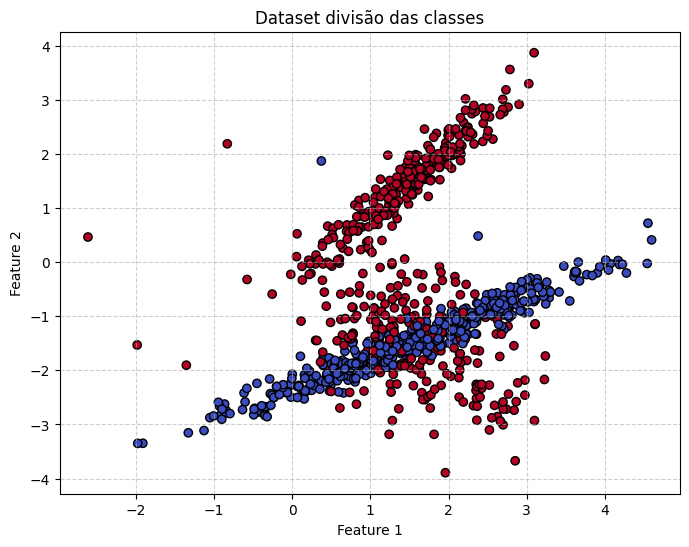
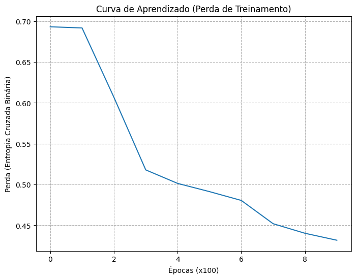
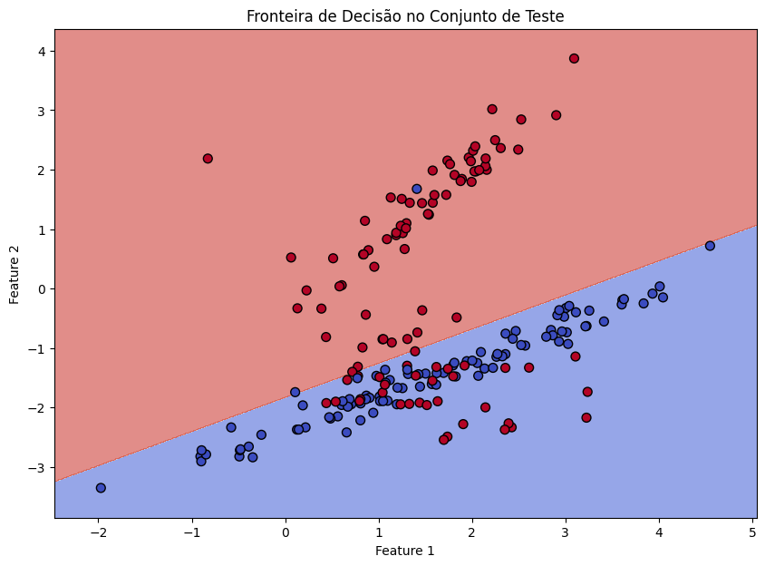
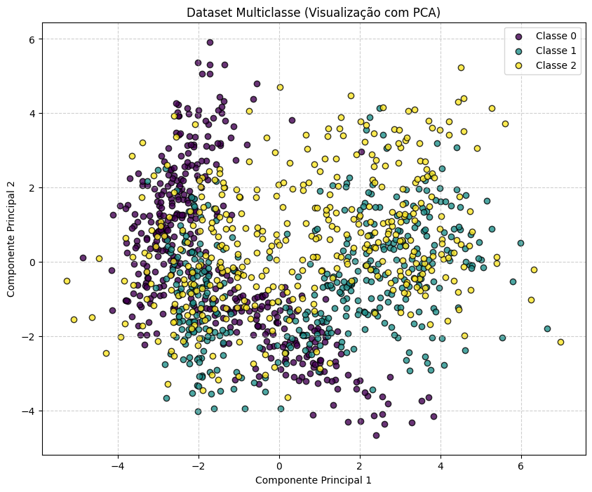
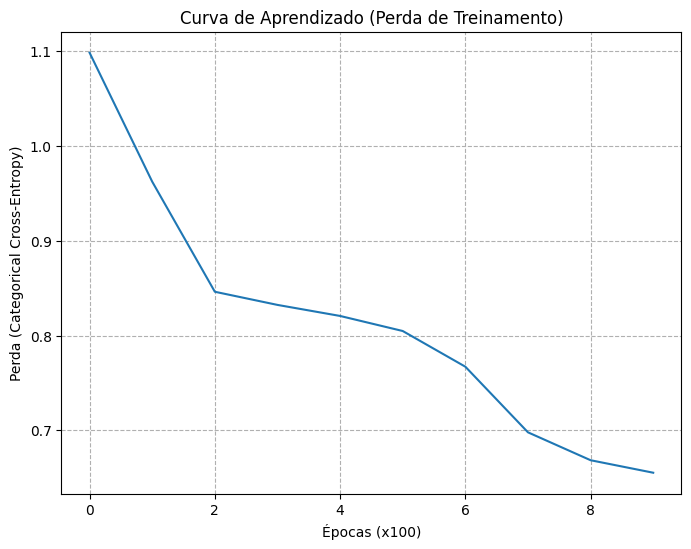
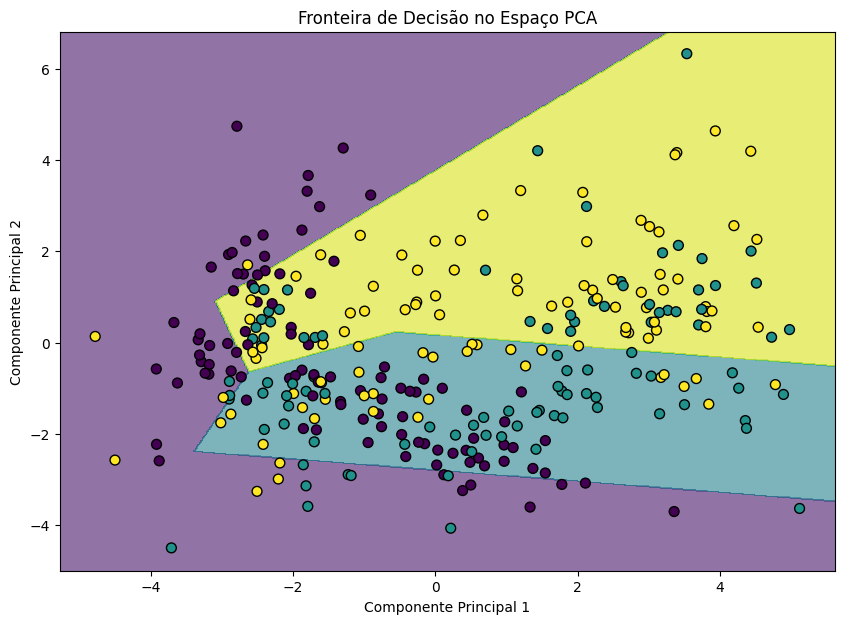
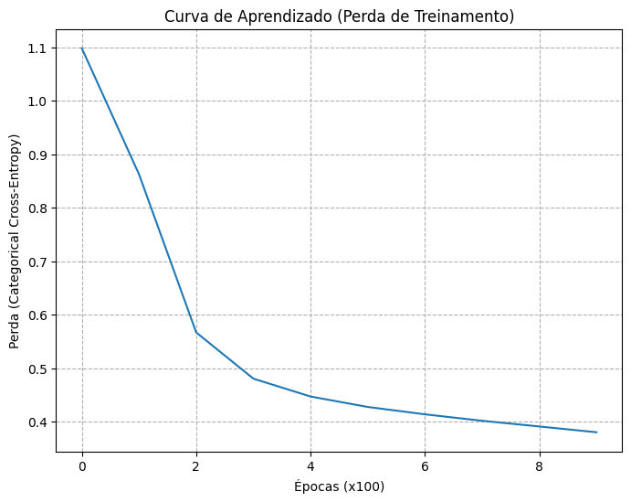
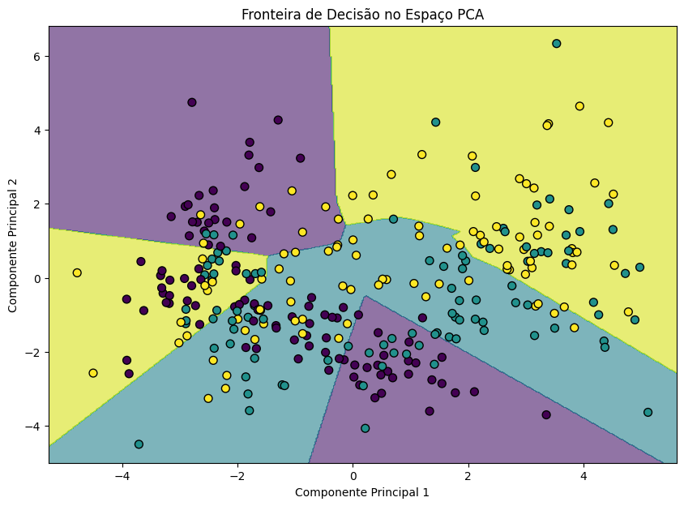

# Redes Neurais - Dados


???+ info inline end "Edição"

    2025.1


## Erik Soares

## Exercício 1: Cálculo Manual dos Passos de uma MLP

Considere uma MLP simples com 2 features de entrada, 1 camada oculta contendo 2 neurônios, e 1 neurônio de saída. Use a função de tangente hiperbólica (tanh) como ativação tanto para a camada oculta quanto para a camada de saída. A função de perda é o erro quadrático médio (MSE): $L = \frac{1}{N} (y - \hat{y})^2$, onde $\hat{y}$ é a saída da rede.

Para este exercício, use os seguintes valores específicos:

* Vetores de entrada e saída:
    $\mathbf{x} = [0.5, -0.2]$
    $y = 1.0$
* Pesos da camada oculta:
    $\mathbf{W}^{(1)} = \begin{bmatrix} 0.3 & -0.1 \\ 0.2 & 0.4 \end{bmatrix}$
* Bias da camada oculta:
    $\mathbf{b}^{(1)} = [0.1, -0.2]$
* Pesos da camada de saída:
    $\mathbf{W}^{(2)} = [0.5, -0.3]$
* Bias da camada de saída:
    $b^{(2)} = 0.2$
* Taxa de aprendizado: $\eta = 0.3$
* Função de ativação: $\tanh$

Execute os seguintes passos explicitamente, mostrando todas as derivações matemáticas e cálculos com os valores fornecidos:

1.  **Passo Forward (Forward Pass)**:
    * Calcule as pré-ativações da camada oculta: $\mathbf{z}^{(1)} = \mathbf{W}^{(1)} \mathbf{x} + \mathbf{b}^{(1)}$.
    * Aplique a tanh para obter as ativações ocultas: $\mathbf{h}^{(1)} = \tanh(\mathbf{z}^{(1)})$.
    * Calcule a pré-ativação da saída: $u^{(2)} = \mathbf{W}^{(2)} \mathbf{h}^{(1)} + b^{(2)}$.
    * Calcule a saída final: $\hat{y} = \tanh(u^{(2)})$.
2.  **Cálculo da Perda**:
    * Calcule a perda MSE:
        $L = \frac{1}{N} (y - \hat{y})^2$.
3.  **Passo Backward (Backpropagation)**: Calcule os gradientes da perda em relação a todos os pesos e Bias.
    Comece com $\displaystyle \frac{\partial L}{\partial \hat{y}}$, depois calcule:
    * $\displaystyle \frac{\partial L}{\partial u^{(2)}}$ (usando a derivada da tanh: $\displaystyle \frac{d}{du} \tanh(u) = 1 - \tanh^2(u)$).
    * Gradientes para a camada de saída: $\displaystyle \frac{\partial L}{\partial \mathbf{W}^{(2)}}$, $\displaystyle \frac{\partial L}{\partial b^{(2)}}$.
    * Propague para a camada oculta: $\displaystyle \frac{\partial L}{\partial \mathbf{h}^{(1)}}$, $\displaystyle \frac{\partial L}{\partial \mathbf{z}^{(1)}}$.
    * Gradientes para a camada oculta: $\displaystyle \frac{\partial L}{\partial \mathbf{W}^{(1)}}$, $\displaystyle \frac{\partial L}{\partial \mathbf{b}^{(1)}}$.

    Mostre todos os passos e cálculos intermediários.

4.  **Atualização dos Parâmetros**: Usando a taxa de aprendizado $\eta = 0.3$
    * $\displaystyle \mathbf{W}^{(2)} \leftarrow \mathbf{W}^{(2)} - \eta \frac{\partial L}{\partial \mathbf{W}^{(2)}}$
    * $\displaystyle b^{(2)} \leftarrow b^{(2)} - \eta \frac{\partial L}{\partial b^{(2)}}$
    * $\displaystyle \mathbf{W}^{(1)} \leftarrow \mathbf{W}^{(1)} - \eta \frac{\partial L}{\partial \mathbf{W}^{(1)}}$
    * $\displaystyle \mathbf{b}^{(1)} \leftarrow \mathbf{b}^{(1)} - \eta \frac{\partial L}{\partial \mathbf{b}^{(1)}}$

    Forneça os valores numéricos para todos os parâmetros atualizados.

Mostrando todos os passos matemáticos explicitamente, incluindo cálculos intermediários (ex: multiplicações de matrizes, aplicações da tanh, derivações de gradientes). Use valores numéricos exatos e evite arredondar excessivamente para manter a precisão (pelo menos 4 casas decimais).

#### Solução

```python
import numpy as np
import matplotlib.pyplot as plt
import pandas as pd
from tqdm import tqdm
np.random.seed(42)

def tanh(x):
    return np.tanh(x)

def tanh_derivative(x):
    return 1 - np.tanh(x)**2

# Vetores de entrada e saída
x = np.array([0.5, -0.2])
y = 1

# Pesos da camada oculta
W1 = np.array([[0.3, -0.1], [0.2, 0.4]])

# Bias da camada oculta
b1 = np.array([0.1, -0.2])

# Pesos da camada de saída
W2 = np.array([0.5, -0.3])

# Bias da camada de saída
b2 = 0.2

# Taxa de aprendizado
learning_rate = 0.3

# Passo Forward
# Pré-ativações da camada oculta
z1 = np.dot(W1, x) + b1
# Ativações ocultas
h1 = tanh(z1)
# Pré-ativação da saída
u2 = np.dot(W2, h1) + b2
# Saída final
y_ = tanh(u2)

# Cálculo da perda
L = (y_ - y)**2

print(f"Valor Real (Alvo): {y}")
print(f"Previsão da Rede: {y_:.4f}")
print(f"Erro Quadrático (Perda): {L:.4f}\n")

# Passo Backward
# Gradiente da perda em relação à saída
dL_dy_ = 2 * (y_ - y)
print(f"Gradiente da Perda em relação à Previsão (dL/dy_): {dL_dy_:.4f}")
# Derivada da tanh na saída
dy_du2 = tanh_derivative(u2)
print(f"Derivada da Ativação de Saída (dy_/du2): {dy_du2:.4f}")
# Sinal de erro na saída
delta2 = dL_dy_ * dy_du2
print(f"Sinal de Erro da Camada de Saída (delta2): {delta2:.4f}")
# Gradientes para a camada de saída
dL_db2 = delta2
dL_dW2 = delta2 * h1
print(f"Gradiente do Bias de Saída (dL/db2): {dL_db2:.4f}")
print(f"Gradiente dos Pesos de Saída (dL/dW2): {dL_dW2}\n")

# Camada oculta
# Derivada de u2 em relação a h1
du2_dh1 = W2
print(f"Derivada da Pré-ativação de Saída em relação à Ativação Oculta (du2/dh1): {du2_dh1}")
# Propaga o sinal de erro para a saída da camada oculta
dL_dh1 = delta2 * du2_dh1
print(f"Gradiente da Perda em relação à Ativação Oculta (dL/dh1): {dL_dh1}")
# Derivada da tanh na camada oculta
dh1_dz1 = tanh_derivative(z1)
print(f"Derivada da Ativação Oculta (dh1/dz1): {dh1_dz1}")
# Sinal de erro na camada oculta
delta1 = dL_dh1 * dh1_dz1
print(f"Sinal de Erro da Camada Oculta (delta1): {delta1}")
# Gradientes para a camada oculta
dL_db1 = delta1
dL_dW1 = np.outer(delta1, x)
print(f"Gradiente do Bias da Camada Oculta (dL/db1): {dL_db1}")
print(f"Gradiente dos Pesos da Camada Oculta (dL/dW1):\n{dL_dW1}\n")

# Atualização dos parâmetros (pesos e Bias)
W1 = W1 - learning_rate * dL_dW1
b1 = b1 - learning_rate * dL_db1

W2 = W2 - learning_rate * dL_dW2
b2 = b2 - learning_rate * dL_db2

print("\nParâmetros atualizados:")
print(f"Pesos da Camada Oculta (W1) Atualizados:\n{W1}")
print(f"Bias da Camada Oculta (b1) Atualizado:\n{b1}")
print(f"Pesos da Camada de Saída (W2) Atualizados:\n{W2}")
print(f"Bias da Camada de Saída (b2) Atualizado:\n{b2}")
```

```
Valor Real (Alvo): 1
Previsão da Rede: 0.3672
Erro Quadrático (Perda): 0.4004

Gradiente da Perda em relação à Previsão (dL/dy_): -1.2655
Derivada da Ativação de Saída (dy_/du2): 0.8651
Sinal de Erro da Camada de Saída (delta2): -1.0948
Gradiente do Bias de Saída (dL/db2): -1.0948
Gradiente dos Pesos de Saída (dL/dW2): [-0.28862383  0.19496791]

Derivada da Pré-ativação de Saída em relação à Ativação Oculta (du2/dh1): [ 0.5 -0.3]
Gradiente da Perda em relação à Ativação Oculta (dL/dh1): [-0.54741396  0.32844837]
Derivada da Ativação Oculta (dh1/dz1): [0.93050195 0.9682872 ]
Sinal de Erro da Camada Oculta (delta1): [-0.50936975  0.31803236]
Gradiente do Bias da Camada Oculta (dL/db1): [-0.50936975  0.31803236]
Gradiente dos Pesos da Camada Oculta (dL/dW1):
[[-0.25468488  0.10187395]
 [ 0.15901618 -0.06360647]]


Parâmetros atualizados:
Pesos da Camada Oculta (W1) Atualizados:
[[ 0.37640546 -0.13056219]
 [ 0.15229515  0.41908194]]
Bias da Camada Oculta (b1) Atualizado:
[ 0.25281093 -0.29540971]
Pesos da Camada de Saída (W2) Atualizados:
[ 0.58658715 -0.35849037]
Bias da Camada de Saída (b2) Atualizado:
0.5284483744140799
```

## Exercício 2: Classificação Binária com Dados Sintéticos e MLP do Zero

Usando a função `make_classification` do scikit-learn (documentação), gere um conjunto de dados sintéticos com as seguintes especificações:

* **Número de amostras:** 1000
* **Número de classes:** 2
* **Número de clusters por classe:** use o parâmetro `n_clusters_per_class` de forma criativa para obter 1 cluster para uma classe e 2 para a outra (dica: pode ser necessário gerar subconjuntos separadamente e combiná-los, pois a função aplica o mesmo número de clusters a todas as classes por padrão).
* **Outros parâmetros:** Defina `n_features=2` para fácil visualização, `n_informative=2`, `n_redundant=0`, `random_state=42` para reprodutibilidade e ajuste `class_sep` ou `flip_y` conforme necessário para um conjunto de dados desafiador, mas separável.

Implemente um MLP do zero (sem usar bibliotecas como TensorFlow ou PyTorch para o modelo em si; você pode usar NumPy para operações de array) para classificar esses dados. Você tem total liberdade para escolher a arquitetura, incluindo:

* Número de camadas ocultas (pelo menos 1)
* Número de neurônios por camada
* Funções de ativação (por exemplo, sigmóide, ReLU, tanh)
* Função de perda (por exemplo, entropia cruzada binária)
* Otimizador (por exemplo, descida de gradiente, com uma taxa de aprendizagem escolhida)

### Passos a seguir:

1.  Gere e divida os dados em conjuntos de treinamento (80%) e de teste (20%).
2.  Implemente a passagem para frente, o cálculo de perdas, a passagem para trás e as atualizações de parâmetros no código.
3.  Treine o modelo para um número razoável de épocas (por exemplo, 100-500), rastreando a perda de treinamento.
4.  Avalie no conjunto de teste: relate a precisão e, opcionalmente, trace limites de decisão ou matriz de confusão.
5.  Envie seu código e resultados, incluindo quaisquer visualizações.

---

### Solução

#### 1. Geração e Divisão dos Dados
```python
import numpy as np
import matplotlib.pyplot as plt
from sklearn.model_selection import train_test_split
from sklearn.datasets import make_classification


#  Gera dados apenas para a Classe 0 com 1 cluster
# Para isso, geramos 2 classes com 1 cluster cada e pegamos apenas a primeira
X_temp1, y_temp1 = make_classification(
    n_samples=1000, # Geramos mais para garantir pelo menos 500 amostras da classe 0
    n_features=2,
    n_informative=2,
    n_redundant=0,
    n_classes=2,
    n_clusters_per_class=1,
    class_sep=1.5,
    random_state=42
)
# Filtramos e pegamos as primeiras 500 amostras da classe 0
X0 = X_temp1[y_temp1 == 0][:500]
y0 = np.zeros((500, 1))


# Gera dados apenas para a Classe 1 com 2 clusters
X_temp2, y_temp2 = make_classification(
    n_samples=1000,
    n_features=2,
    n_informative=2,
    n_redundant=0,
    n_classes=2,
    n_clusters_per_class=2,
    class_sep=1.5,
    random_state=43
)
# Filtramos e pegamos as primeiras 500 amostras da classe 1
X1 = X_temp2[y_temp2 == 1][:500]
y1 = np.ones((500, 1))

X = np.vstack((X0, X1))
y = np.vstack((y0, y1))

# Embaralhando o dataset
shuffle_idx = np.random.permutation(len(X))
X = X[shuffle_idx]
y = y[shuffle_idx]

X_train, X_test, y_train, y_test = train_test_split(
    X, y, test_size=0.2, random_state=42, stratify=y
)


plt.figure(figsize=(8, 6))
plt.scatter(X[:, 0], X[:, 1], c=y.ravel(), cmap='coolwarm', edgecolors='k')
plt.title("Dataset divisão das classes")
plt.xlabel("Feature 1")
plt.ylabel("Feature 2")
plt.grid(True, linestyle='--', alpha=0.6)
plt.show()
```



#### 2. Implementação do MLP do Zero
##### Funções Auxiliares
```python
def sigmoid(Z):
    """Calcula a função sigmoide"""
    return 1 / (1 + np.exp(-Z))

def relu(Z):
    """Calcula a função ReLU."""
    return np.maximum(0, Z)


def relu_derivative(Z):
    """Calcula a derivada da ReLU"""
    return np.where(Z > 0, 1, 0)

def initialize_parameters(n_x, n_h, n_y):
    """Inicializa os pesos e biases da rede"""
    np.random.seed(42)
    W1 = np.random.randn(n_h, n_x) * 0.01
    b1 = np.zeros((n_h, 1))
    W2 = np.random.randn(n_y, n_h) * 0.01
    b2 = np.zeros((n_y, 1))
    parameters = {"W1": W1, "b1": b1, "W2": W2, "b2": b2}
    return parameters

def forward_pass(X, parameters):
    """Executa a passagem para frente (forward propagation)"""
    W1, b1, W2, b2 = parameters["W1"], parameters["b1"], parameters["W2"], parameters["b2"]
    Z1 = np.dot(W1, X.T) + b1
    A1 = relu(Z1)
    Z2 = np.dot(W2, A1) + b2
    A2 = sigmoid(Z2)
    cache = {"Z1": Z1, "A1": A1, "Z2": Z2, "A2": A2}
    return A2, cache

def compute_loss(A2, Y):
    """Calcula a perda (Entropia cruzda binaria)"""
    m = Y.shape[0]
    epsilon = 1e-8
    loss = -1/m * np.sum(Y.T * np.log(A2 + epsilon) + (1 - Y.T) * np.log(1 - A2 + epsilon))
    return np.squeeze(loss)

def backward_pass(parameters, cache, X, Y):
    """Executa o backpropagation"""
    m = X.shape[0]
    W2 = parameters["W2"]
    A1, A2 = cache["A1"], cache["A2"]
    Z1 = cache["Z1"]
    
    dZ2 = A2 - Y.T
    dW2 = 1/m * np.dot(dZ2, A1.T)
    db2 = 1/m * np.sum(dZ2, axis=1, keepdims=True)
    
    dA1 = np.dot(W2.T, dZ2)
    dZ1 = dA1 * relu_derivative(Z1)
    dW1 = 1/m * np.dot(dZ1, X)
    db1 = 1/m * np.sum(dZ1, axis=1, keepdims=True)
    
    grads = {"dW1": dW1, "db1": db1, "dW2": dW2, "db2": db2}
    return grads

def update_parameters(parameters, grads, learning_rate):
    """Atualiza os pesos e biases usando gradiente descendente."""
    W1, b1, W2, b2 = parameters["W1"], parameters["b1"], parameters["W2"], parameters["b2"]
    dW1, db1, dW2, db2 = grads["dW1"], grads["db1"], grads["dW2"], grads["db2"]
    
    W1 = W1 - learning_rate * dW1
    b1 = b1 - learning_rate * db1
    W2 = W2 - learning_rate * dW2
    b2 = b2 - learning_rate * db2
    
    parameters = {"W1": W1, "b1": b1, "W2": W2, "b2": b2}
    return parameters

def predict(X, parameters):
    """Faz previsões usando o modelo treinado."""
    A2, _ = forward_pass(X, parameters)
    predictions = (A2 > 0.5)
    return predictions.astype(int)
```

##### Treinamento do Modelo e Plotagem da Curva de Aprendizado
```python
def mlp_model(X, Y, n_h, num_epochs, learning_rate):
    """Constrói e treina o modelo MLP completo."""
    n_x = X.shape[1]
    n_y = Y.shape[1]
    
    parameters = initialize_parameters(n_x, n_h, n_y)
    losses = []
        
    for i in range(num_epochs):
        A2, cache = forward_pass(X, parameters)
        loss = compute_loss(A2, Y)
        grads = backward_pass(parameters, cache, X, Y)
        parameters = update_parameters(parameters, grads, learning_rate)
        
        if i % 100 == 0:
            losses.append(loss)
            print(f"Época {i}, Perda: {loss:.4f}")
            
    return parameters, losses

trained_parameters, training_losses = mlp_model(
    X_train, y_train, n_h=2, num_epochs=1000, learning_rate=0.1
)


plt.figure(figsize=(8, 6))
plt.plot(training_losses)
plt.title("Curva de Aprendizado (Perda de Treinamento)")
plt.xlabel("Épocas (x100)")
plt.ylabel("Perda (Entropia Cruzada Binária)")
plt.grid(True, linestyle='--')
plt.show()
```


##### 3. Avaliação do Modelo no Conjunto de Teste
```python
test_predictions = predict(X_test, trained_parameters)
accuracy = np.mean(test_predictions == y_test.T) * 100
print(f"\nAcurácia no conjunto de teste: {accuracy:.2f}%")


def plot_decision_boundary(X, y, parameters):
    """Plota a fronteira de decisão aprendida pelo modelo."""
    plt.figure(figsize=(10, 7))
    
    x_min, x_max = X[:, 0].min() - 0.5, X[:, 0].max() + 0.5
    y_min, y_max = X[:, 1].min() - 0.5, X[:, 1].max() + 0.5
    
    h = 0.01
    xx, yy = np.meshgrid(np.arange(x_min, x_max, h), np.arange(y_min, y_max, h))
    
    Z = predict(np.c_[xx.ravel(), yy.ravel()], parameters)
    Z = Z.reshape(xx.shape)
    
    plt.contourf(xx, yy, Z, cmap='coolwarm', alpha=0.6)
    plt.scatter(X[:, 0], X[:, 1], c=y.ravel(), cmap='coolwarm', edgecolors='k', s=50)
    
    plt.title("Fronteira de Decisão no Conjunto de Teste")
    plt.xlabel("Feature 1")
    plt.ylabel("Feature 2")
    plt.show()

# Visualizando a fronteira de decisão com os dados de teste
plot_decision_boundary(X_test, y_test, trained_parameters)
```
- Acurácia no conjunto de teste: 82.00%


## Exercício 3: Classificação Multiclasse com Dados Sintéticos e MLP Reutilizável

Semelhante ao Exercício 2, mas com maior complexidade. Use `make_classification` para gerar um conjunto de dados sintéticos com:

* **Número de amostras:** 1500
* **Número de classes:** 3
* **Número de features:** 4
* **Número de clusters por classe:** obtenha 2 clusters para uma classe, 3 para outra e 4 para a última (novamente, pode ser necessário gerar subconjuntos separadamente e combiná-los, pois a função não oferece suporte direto à variação de clusters por classe).
* **Outros parâmetros:** `n_features=4`, `n_informative=4`, `n_redundant=0`, `random_state=42`.

Implemente um MLP do zero para classificar esses dados. Você pode escolher a arquitetura livremente, mas, para ganhar um ponto extra (elevando este exercício para 4 pontos), reutilize exatamente o mesmo código de implementação do MLP do Exercício 2, modificando apenas os hiperparâmetros (por exemplo, tamanho da camada de saída para 3 classes, função de perda para entropia cruzada categórica, se necessário) sem alterar a estrutura principal.

**Passos:**

1.  Gerar e dividir os dados (treinamento/teste 80/20).
2.  Treine o modelo, rastreando perdas.
3.  Avalie no conjunto de teste: relate a precisão e, opcionalmente, visualize (por exemplo, gráfico de dispersão de dados com rótulos previstos).
4.  Envie o código e os resultados.

### Solução
#### 1. Geração e Divisão dos Dados
```python
import numpy as np
import matplotlib.pyplot as plt
from sklearn.model_selection import train_test_split
from sklearn.datasets import make_classification
from sklearn.decomposition import PCA

# Gera dados para a Classe 0 com 2 clusters
X_temp0, y_temp0 = make_classification(
    n_samples=1000,
    n_features=4,
    n_informative=4,
    n_redundant=0,
    n_classes=2,
    n_clusters_per_class=2,
    class_sep=1.5,
    random_state=42
)
X0 = X_temp0[y_temp0 == 0][:500]
y0 = np.zeros((500, 1))

# Gera dados para a Classe 1 com 3 clusters
X_temp1, y_temp1 = make_classification(
    n_samples=1500,
    n_features=4,
    n_informative=4,
    n_redundant=0,
    n_classes=2,
    n_clusters_per_class=3,
    class_sep=1.5,
    random_state=43
)
X1 = X_temp1[y_temp1 == 1][:500]
y1 = np.ones((500, 1))

# Gera dados para a Classe 2 com 4 clusters
X_temp2, y_temp2 = make_classification(
    n_samples=2000,
    n_features=4,
    n_informative=4,
    n_redundant=0,
    n_classes=2,
    n_clusters_per_class=4,
    class_sep=1.5,
    random_state=44
)
X2 = X_temp2[y_temp2 == 0][:500]
y2 = np.full((500, 1), 2)

X = np.vstack((X0, X1, X2))
y = np.vstack((y0, y1, y2))

shuffle_idx = np.random.permutation(len(X))
X = X[shuffle_idx]
y = y[shuffle_idx]

X_train, X_test, y_train, y_test = train_test_split(
    X, y, test_size=0.2, random_state=42, stratify=y
)

pca = PCA(n_components=2)
pca.fit(X_train)
X_train_pca = pca.transform(X_train)
X_test_pca = pca.transform(X_test)

plt.figure(figsize=(10, 8)) 

classes = np.unique(y_train)
colors = plt.cm.viridis(np.linspace(0, 1, len(classes)))

for i, class_label in enumerate(classes):
    # Filtra os dados para pegar apenas os pontos da classe atual
    X_class = X_train_pca[y_train.ravel() == class_label]
    # Plota os pontos da classe atual com sua cor e rótulo específicos
    plt.scatter(X_class[:, 0], X_class[:, 1],
                color=colors[i],
                label=f'Classe {int(class_label)}',
                edgecolors='k', alpha=0.8)


plt.title("Dataset Multiclasse (Visualização com PCA)")
plt.xlabel("Componente Principal 1")
plt.ylabel("Componente Principal 2")
plt.grid(True, linestyle='--', alpha=0.6)
plt.legend()
plt.show()
```


#### 2. Implementação do MLP do Zero
##### Funções Auxiliares
```python
def softmax(Z):
    """Calcula a função softmax."""
    expZ = np.exp(Z - np.max(Z, axis=0, keepdims=True))
    return expZ / np.sum(expZ, axis=0, keepdims=True)

def relu(Z):
    """Calcula a função ReLU."""
    return np.maximum(0, Z)

def relu_derivative(Z):
    """Calcula a derivada da ReLU"""
    return np.where(Z > 0, 1, 0)

def initialize_parameters(n_x, n_h, n_y):
    """Inicializa os pesos e biases da rede"""
    np.random.seed(42)
    W1 = np.random.randn(n_h, n_x) * 0.01
    b1 = np.zeros((n_h, 1))
    W2 = np.random.randn(n_y, n_h) * 0.01
    b2 = np.zeros((n_y, 1))
    parameters = {"W1": W1, "b1": b1, "W2": W2, "b2": b2}
    return parameters

def forward_pass(X, parameters):
    """Executa a passagem para frente (forward propagation)"""
    W1, b1, W2, b2 = parameters["W1"], parameters["b1"], parameters["W2"], parameters["b2"]
    Z1 = np.dot(W1, X.T) + b1
    A1 = relu(Z1)
    Z2 = np.dot(W2, A1) + b2
    A2 = softmax(Z2)
    cache = {"Z1": Z1, "A1": A1, "Z2": Z2, "A2": A2}
    return A2, cache

def compute_loss(A2, Y_one_hot):
    """Calcula a perda (Entropia cruzada categórica)."""
    m = Y_one_hot.shape[1]
    epsilon = 1e-8
    loss = -1/m * np.sum(Y_one_hot * np.log(A2 + epsilon))
    return np.squeeze(loss)

def backward_pass(parameters, cache, X, Y_one_hot):
    """Executa o backpropagation"""
    m = X.shape[0]
    W2 = parameters["W2"]
    A1, A2 = cache["A1"], cache["A2"]
    Z1 = cache["Z1"]

    dZ2 = A2 - Y_one_hot
    dW2 = 1/m * np.dot(dZ2, A1.T)
    db2 = 1/m * np.sum(dZ2, axis=1, keepdims=True)
    
    dA1 = np.dot(W2.T, dZ2)
    dZ1 = dA1 * relu_derivative(Z1)
    dW1 = 1/m * np.dot(dZ1, X)
    db1 = 1/m * np.sum(dZ1, axis=1, keepdims=True)
    
    grads = {"dW1": dW1, "db1": db1, "dW2": dW2, "db2": db2}
    return grads

def update_parameters(parameters, grads, learning_rate):
    """Atualiza os pesos e biases usando gradiente descendente."""
    W1, b1, W2, b2 = parameters["W1"], parameters["b1"], parameters["W2"], parameters["b2"]
    dW1, db1, dW2, db2 = grads["dW1"], grads["db1"], grads["dW2"], grads["db2"]
    
    W1 = W1 - learning_rate * dW1
    b1 = b1 - learning_rate * db1
    W2 = W2 - learning_rate * dW2
    b2 = b2 - learning_rate * db2
    
    parameters = {"W1": W1, "b1": b1, "W2": W2, "b2": b2}
    return parameters

def predict(X, parameters):
    """Faz previsões usando o modelo treinado."""
    A2, _ = forward_pass(X, parameters)
    # A previsão é o índice da classe com maior probabilidade
    predictions = np.argmax(A2, axis=0)
    return predictions

def one_hot(y, num_classes):
    """Converte um vetor de rótulos para o formato one-hot."""
    y = y.astype(int)
    y_one_hot = np.eye(num_classes)[y.ravel()]
    return y_one_hot.T
```
##### Treinamento do Modelo e Plotagem da Curva de Aprendizado
```python
def mlp_model(X, Y, n_h, num_epochs, learning_rate):
    """Constrói e treina o modelo MLP completo."""
    n_x = X.shape[1]
    num_classes = len(np.unique(Y))
    n_y = num_classes
    
    Y_one_hot = one_hot(Y, num_classes)
    
    parameters = initialize_parameters(n_x, n_h, n_y)
    losses = []
        
    for i in range(num_epochs):
        A2, cache = forward_pass(X, parameters)
        loss = compute_loss(A2, Y_one_hot)
        grads = backward_pass(parameters, cache, X, Y_one_hot)
        parameters = update_parameters(parameters, grads, learning_rate)
        
        if i % 100 == 0:
            losses.append(loss)
            print(f"Época {i}, Perda: {loss:.4f}")
            
    return parameters, losses

trained_parameters, training_losses = mlp_model(
    X_train, y_train, n_h=2, num_epochs=1000, learning_rate=0.1
)

plt.figure(figsize=(8, 6))
plt.plot(training_losses)
plt.title("Curva de Aprendizado (Perda de Treinamento)")
plt.xlabel("Épocas (x100)")
plt.ylabel("Perda (Categorical Cross-Entropy)")
plt.grid(True, linestyle='--')
plt.show()
```


##### 3. Avaliação do Modelo no Conjunto de Teste
Como temos 4 dimensões nos dados, utilizamos PCA para ajudar na visualização
```python
import numpy as np
import matplotlib.pyplot as plt
from sklearn.decomposition import PCA 

test_predictions = predict(X_test, trained_parameters)

accuracy = np.mean(test_predictions == y_test.ravel()) * 100
print(f"\nAcurácia no conjunto de teste: {accuracy:.2f}%")

pca = PCA(n_components=2)

# Treinamos o PCA apenas com os dados de treino
pca.fit(X_train)

X_train_pca = pca.transform(X_train)
X_test_pca = pca.transform(X_test)

def plot_decision_boundary_pca(X_pca, y_data, pca_object, parameters):
    """Plota a fronteira de decisão no espaço PCA."""
    plt.figure(figsize=(10, 7))
    
    x_min, x_max = X_pca[:, 0].min() - 0.5, X_pca[:, 0].max() + 0.5
    y_min, y_max = X_pca[:, 1].min() - 0.5, X_pca[:, 1].max() + 0.5
    
    h = 0.02
    xx, yy = np.meshgrid(np.arange(x_min, x_max, h), np.arange(y_min, y_max, h))
    
    grid_points_2d = np.c_[xx.ravel(), yy.ravel()]
    
    # Usa a transformação inversa do PCA para converter os pontos da malha
    # de volta para o espaço 4D original, para que o modelo possa prever
    grid_points_4d_original = pca_object.inverse_transform(grid_points_2d)
    
    Z = predict(grid_points_4d_original, parameters)
    Z = Z.reshape(xx.shape)
    
    plt.contourf(xx, yy, Z, cmap='viridis', alpha=0.6)
    # Plota os dados de teste já transformados pelo PCA
    plt.scatter(X_pca[:, 0], X_pca[:, 1], c=y_data.ravel(), cmap='viridis', edgecolors='k', s=50)
    
    plt.title("Fronteira de Decisão no Espaço PCA")
    plt.xlabel("Componente Principal 1")
    plt.ylabel("Componente Principal 2")
    plt.show()

plot_decision_boundary_pca(X_test_pca, y_test, pca, trained_parameters)
```
- Acurácia no conjunto de teste: 66.67%



## Exercício 4: Classificação multiclasse com MLP mais profundo

Repita o Exercício 3 exatamente, mas agora certifique-se de que seu MLP tenha **pelo menos 2 camadas ocultas**. Você pode ajustar o número de neurônios por camada conforme necessário para obter melhor desempenho. Reutilize o código do Exercício 3 sempre que possível, mas o foco está em demonstrar a arquitetura mais profunda. Envie o código atualizado, os resultados do treinamento e a avaliação dos testes.

### Solução
#### 1. Treinamento do Modelo com MLP mais Profundo
```python
def mlp_model(X, Y, n_h, num_epochs, learning_rate):
    """Constrói e treina o modelo MLP completo."""
    n_x = X.shape[1]
    num_classes = len(np.unique(Y))
    n_y = num_classes
    
    Y_one_hot = one_hot(Y, num_classes)
    
    parameters = initialize_parameters(n_x, n_h, n_y)
    losses = []
        
    for i in range(num_epochs):
        A2, cache = forward_pass(X, parameters)
        loss = compute_loss(A2, Y_one_hot)
        grads = backward_pass(parameters, cache, X, Y_one_hot)
        parameters = update_parameters(parameters, grads, learning_rate)
        
        if i % 100 == 0:
            losses.append(loss)
            print(f"Época {i}, Perda: {loss:.4f}")
            
    return parameters, losses

trained_parameters, training_losses = mlp_model(
    X_train, y_train, n_h=20, num_epochs=1000, learning_rate=0.1
)

plt.figure(figsize=(8, 6))
plt.plot(training_losses)
plt.title("Curva de Aprendizado (Perda de Treinamento)")
plt.xlabel("Épocas (x100)")
plt.ylabel("Perda (Categorical Cross-Entropy)")
plt.grid(True, linestyle='--')
plt.show()
```


#### 2. Avaliação do Modelo no Conjunto de Teste
```python
import numpy as np
import matplotlib.pyplot as plt
from sklearn.decomposition import PCA 

test_predictions = predict(X_test, trained_parameters)

accuracy = np.mean(test_predictions == y_test.ravel()) * 100
print(f"\nAcurácia no conjunto de teste: {accuracy:.2f}%")

pca = PCA(n_components=2)

# Treinamos o PCA apenas com os dados de treino
pca.fit(X_train)

X_train_pca = pca.transform(X_train)
X_test_pca = pca.transform(X_test)

def plot_decision_boundary_pca(X_pca, y_data, pca_object, parameters):
    """Plota a fronteira de decisão no espaço PCA."""
    plt.figure(figsize=(10, 7))
    
    x_min, x_max = X_pca[:, 0].min() - 0.5, X_pca[:, 0].max() + 0.5
    y_min, y_max = X_pca[:, 1].min() - 0.5, X_pca[:, 1].max() + 0.5
    
    h = 0.02
    xx, yy = np.meshgrid(np.arange(x_min, x_max, h), np.arange(y_min, y_max, h))
    
    grid_points_2d = np.c_[xx.ravel(), yy.ravel()]
    
    # Usa a transformação inversa do PCA para converter os pontos da malha
    # de volta para o espaço 4D original, para que o modelo possa prever
    grid_points_4d_original = pca_object.inverse_transform(grid_points_2d)
    
    Z = predict(grid_points_4d_original, parameters)
    Z = Z.reshape(xx.shape)
    
    plt.contourf(xx, yy, Z, cmap='viridis', alpha=0.6)
    # Plota os dados de teste já transformados pelo PCA
    plt.scatter(X_pca[:, 0], X_pca[:, 1], c=y_data.ravel(), cmap='viridis', edgecolors='k', s=50)
    
    plt.title("Fronteira de Decisão no Espaço PCA")
    plt.xlabel("Componente Principal 1")
    plt.ylabel("Componente Principal 2")
    plt.show()

plot_decision_boundary_pca(X_test_pca, y_test, pca, trained_parameters)
```
- Acurácia no conjunto de teste: 81.33%


Obs: Partes desse relatório foram gerados com o auxílio de IA.