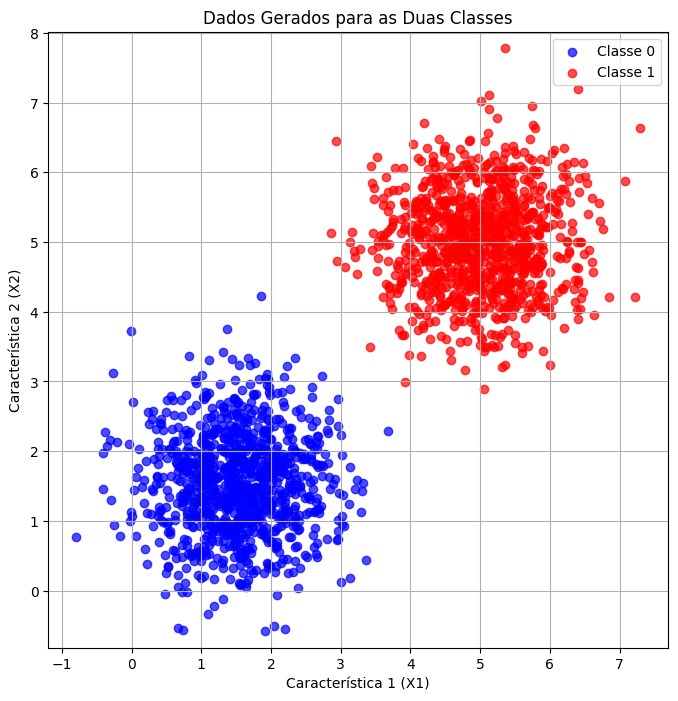
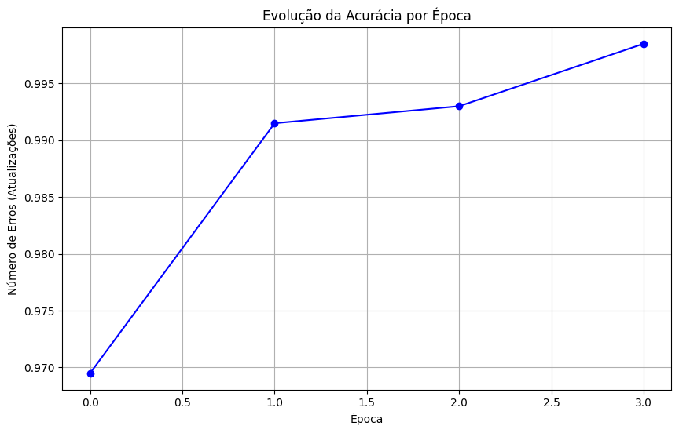
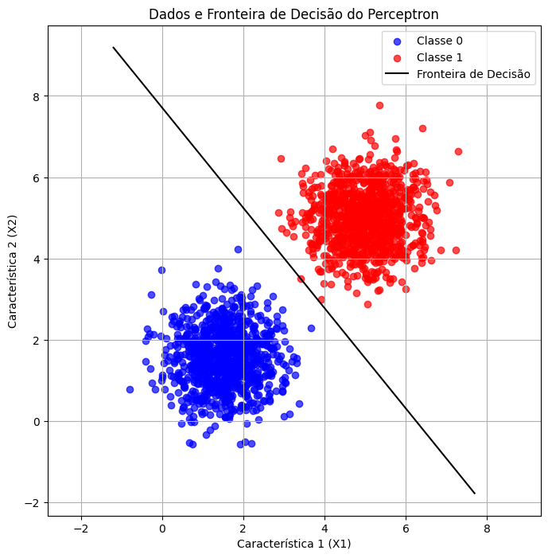
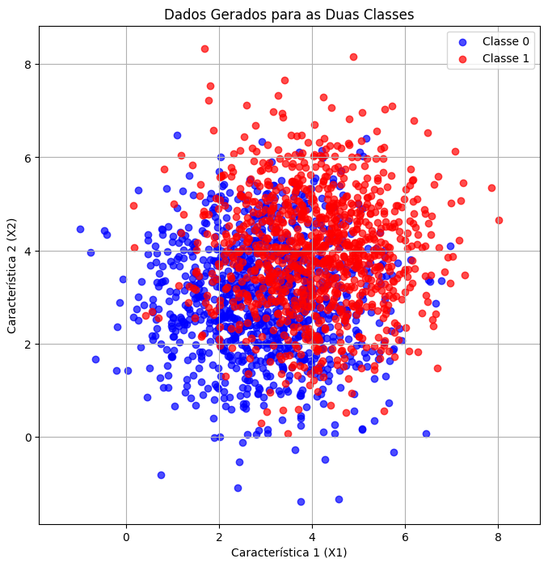
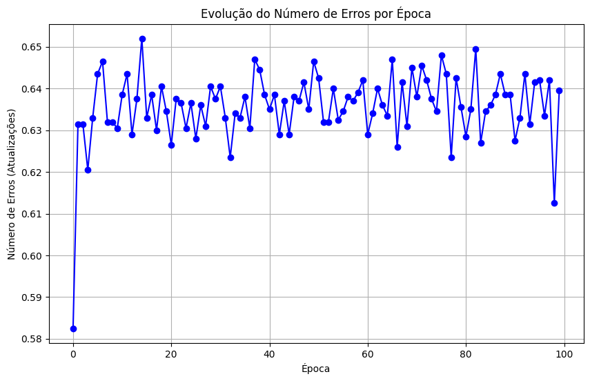
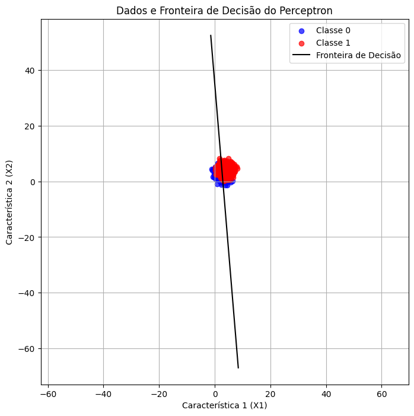

# Redes Neurais - Perceptron


???+ info inline end "Edição"

    2025.1


## Erik Soares

Esta atividade tem como objetivo a implementação e testes com Perceptrons e suas limitações.

## Parte 1 - Dados Linearmente Separáveis

### Geração de Dados


1.  **Geração dos Dados:** Geração de duas classes de pontos de dados 2D (1.000 amostras por classe) usando distribuições normais multivariadas. Com base nos seguintes parâmetros:
    *   Classe 0: Média = [1.5, 1.5], Desvio Padrão = [[0.5, 0],[0, 0.5]]
    *   Classe 1: Média = [5, 5], Desvio Padrão = [[0.5, 0],[0, 0.5]]

2.  **Plotagem dos Dados:** Esses parâmetros garantem que as classes sejam separáveis ​​linearmente, com sobreposição mínima devido à distância entre médias e à baixa variância.

##### Geração e Plotagem dos Dados

O código abaixo gera os dados sintéticos conforme as especificações e os plota em um gráfico de dispersão 2D.
```python
n_amostras_0 = 1000
n_amostras_1 = 1000

media_0 = np.array([1.5, 1.5])
media_1 = np.array([5, 5])

covariancia_0 = np.array([
    [0.5, 0],
    [0, 0.5]
])

covariancia_1 = np.array([
    [0.5, 0],
    [0, 0.5]
])

dados_0 = np.random.multivariate_normal(mean=media_0, cov=covariancia_0, size=n_amostras_0)
dados_1 = np.random.multivariate_normal(mean=media_1, cov=covariancia_1, size=n_amostras_1)
dados = np.concatenate([dados_0, dados_1])
rotulos_0 = np.zeros(n_amostras_0)
rotulos_1 = np.ones(n_amostras_1)
rotulos = np.concatenate([rotulos_0, rotulos_1])
dados_com_rotulos = np.c_[dados, rotulos]
df = pd.DataFrame(dados_com_rotulos, columns=['x1', 'x2', 'y'])
df = df.sample(frac=1)

plt.figure(figsize=(8, 8))

plt.scatter(dados_0[:, 0], dados_0[:, 1], c='blue', label='Classe 0', alpha=0.7)

plt.scatter(dados_1[:, 0], dados_1[:, 1], c='red', label='Classe 1', alpha=0.7)

plt.title('Dados Gerados para as Duas Classes')
plt.xlabel('Característica 1 (X1)')
plt.ylabel('Característica 2 (X2)')
plt.legend()
plt.grid(True)
plt.axis('equal') 
plt.show()
```


3.  **Implementação de Perceptron:** 
Implementação de um perceptron de camada única do zero para classificar os dados gerados em duas classes.
* Inicialização dos pesos (w) como um vetor 2D (mais um termo de polarização b).

* Uso da regra de aprendizado do perceptron: para cada amostra classificada incorretamente $(x, y)$, atualização de $w = w + \eta \cdot y \cdot x$ e $b = b + \eta \cdot y$, onde $\eta$ é a taxa de aprendizagem (começando com $\eta = 0.01$).

* Treinamento do modelo até a convergência ou por um máximo de 100 épocas, o que ocorrer primeiro.

### Perceptron

O código abaixo implementa o perceptron e realiza o treinamento nos dados gerados.
```python
def perceptron(X, y, epocas=100, b=0, eta=0.01):
    w = np.array([0.0, 0.0])
    acuracias = []

    for _ in tqdm(range(epocas)):
        erros = 0
        for i in range(len(X)):
            z = np.dot(X[i], w) + b
            y_pred = 1.0 if z >= 0.0 else 0.0
            erro = y[i] - y_pred
            if erro != 0:
                erros += 1
                w = w + eta * erro * X[i]
                b = b + eta * erro
                
        acuracias.append((len(X) - erros)/len(X))
        if erros == 0:
            break
    
    return w, b, acuracias

X = df[["x1", "x2"]].values
y = df["y"].values

w1, b1, precisoes1 = perceptron(X, y)
```

### Visualização dos Resultados

Os gráficos abaixo mostram a evolução da acurácia ao longo das épocas e a fronteira de decisão aprendida pelo perceptron.
```python
plt.figure(figsize=(10, 6))
plt.plot(range(len(precisoes1)), precisoes1, marker='o', linestyle='-', color='b')
plt.title('Evolução da Acurácia por Época')
plt.xlabel('Época')
plt.ylabel('Acurácia')
plt.grid(True)
plt.show()
```



```python
plt.figure(figsize=(8, 8))

plt.scatter(dados_0[:, 0], dados_0[:, 1], c='blue', label='Classe 0', alpha=0.7)
plt.scatter(dados_1[:, 0], dados_1[:, 1], c='red', label='Classe 1', alpha=0.7)

x_min, x_max = plt.xlim()
x1_plot = np.array([x_min, x_max])
x2_plot = (-w1[0] * x1_plot - b1) / w1[1]

plt.plot(x1_plot, x2_plot, 'k-', label='Fronteira de Decisão')

plt.title('Dados e Fronteira de Decisão do Perceptron')
plt.xlabel('Característica 1 (X1)')
plt.ylabel('Característica 2 (X2)')
plt.legend()
plt.grid(True)
plt.axis('equal')

plt.show()
```


##### Resultados Finais
Pesos Finais: [0.0527598, 0.04278312]

Bias Final: -0.33

Precisão Final: 1.0


Ao utilizarmos um conjunto de dados que é linearmente separável, o perceptron consegue encontrar uma fronteira de decisão que separa perfeitamente as duas classes. Isso ocorre porque os dados foram gerados com médias distintas e baixa variância, o que minimiza a sobreposição entre as classes. Como resultado, o perceptron pode ajustar seus pesos e viés rapidamente para alcançar uma precisão de 100% em poucas épocas de treinamento, já que necessita de apenas algumas atualizações para alinhar a fronteira de decisão corretamente.

## Parte 2 - Dados Não Linearmente Separáveis

### Geração de Dados 


1.  **Geração dos Dados:** Geração de duas classes de pontos de dados 2D (1.000 amostras por classe) usando distribuições normais multivariadas. Com base nos seguintes parâmetros:
    *   Classe 0: Média = [3, 3], Desvio Padrão = [[1.5, 0],[0, 1.5]]
    *   Classe 1: Média = [4, 4], Desvio Padrão = [[1.5, 0],[0, 1.5]]

2.  **Plotagem dos Dados:** Esses parâmetros criam sobreposição parcial entre as classes devido a médias mais próximas e maior variância, tornando os dados não totalmente separáveis ​​linearmente

##### Geração e Plotagem dos Dados

O código abaixo gera os dados sintéticos conforme as especificações e os plota em um gráfico de dispersão 2D.
```python
n_amostras_0 = 1000
n_amostras_1 = 1000

media_0 = np.array([3, 3])
media_1 = np.array([4, 4])

covariancia_0 = np.array([
    [1.5, 0],
    [0, 1.5]
])

covariancia_1 = np.array([
    [1.5, 0],
    [0, 1.5]
])

dados_0 = np.random.multivariate_normal(mean=media_0, cov=covariancia_0, size=n_amostras_0)
dados_1 = np.random.multivariate_normal(mean=media_1, cov=covariancia_1, size=n_amostras_1)
dados = np.concatenate([dados_0, dados_1])
rotulos_0 = np.zeros(n_amostras_0)
rotulos_1 = np.ones(n_amostras_1)
rotulos = np.concatenate([rotulos_0, rotulos_1])
dados_com_rotulos = np.c_[dados, rotulos]
df = pd.DataFrame(dados_com_rotulos, columns=['x1', 'x2', 'y'])
df = df.sample(frac=1)

plt.figure(figsize=(8, 8))

plt.scatter(dados_0[:, 0], dados_0[:, 1], c='blue', label='Classe 0', alpha=0.7)

plt.scatter(dados_1[:, 0], dados_1[:, 1], c='red', label='Classe 1', alpha=0.7)

plt.title('Dados Gerados para as Duas Classes')
plt.xlabel('Característica 1 (X1)')
plt.ylabel('Característica 2 (X2)')
plt.legend()
plt.grid(True)
plt.axis('equal') 
plt.show()
```



3.  **Implementação de Perceptron:** 
Implementação de um perceptron seguindo as mesmas etapas do exercício anterior.

### Perceptron

O código abaixo implementa o perceptron e realiza o treinamento nos dados gerados, seguindo as mesmas etapas do exercício anterior.
```python
X = df[["x1", "x2"]].values
y = df["y"].values

w2, b2, precisoes2 = perceptron(X, y)
```

### Visualização dos Resultados

Os gráficos abaixo mostram a evolução da acurácia ao longo das épocas e a fronteira de decisão aprendida pelo perceptron.

```python
plt.figure(figsize=(10, 6))
plt.plot(range(len(precisoes2)), precisoes2, marker='o', linestyle='-', color='b')
plt.title('Evolução da Acurácia por Época')
plt.xlabel('Época')
plt.ylabel('Acurácia')
plt.grid(True)
plt.show()
```


```python
plt.figure(figsize=(8, 8))

plt.scatter(dados_0[:, 0], dados_0[:, 1], c='blue', label='Classe 0', alpha=0.7)
plt.scatter(dados_1[:, 0], dados_1[:, 1], c='red', label='Classe 1', alpha=0.7)

x_min, x_max = plt.xlim()
x1_plot = np.array([x_min, x_max])
x2_plot = (-w2[0] * x1_plot - b2) / w2[1]

plt.plot(x1_plot, x2_plot, 'k-', label='Fronteira de Decisão')

plt.title('Dados e Fronteira de Decisão do Perceptron')
plt.xlabel('Característica 1 (X1)')
plt.ylabel('Característica 2 (X2)')
plt.legend()
plt.grid(True)
plt.axis('equal')

plt.show()
```


##### Resultados Finais
Pesos Finais: [0.15110298, 0.01252476]

Bias Final: -0.44

Precisão Final: 0.6395


Ao utilizarmos um conjunto de dados que não é linearmente separável, um perceptron simples é incapaz de encontrar uma fronteira de decisão que classifique perfeitamente todas as amostras. Isso ocorre porque o perceptron é um classificador linear e, quando as classes se sobrepõem, não há uma linha reta que possa separar todas as amostras de uma classe das da outra. Como resultado, o treinamento do perceptron tende a não convergir para uma solução que classifique corretamente todas as amostras, levando a uma precisão final inferior a 100%.

Obs: Partes desse relatório foram gerados com o auxílio de IA.