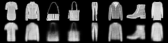
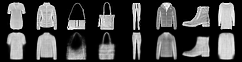
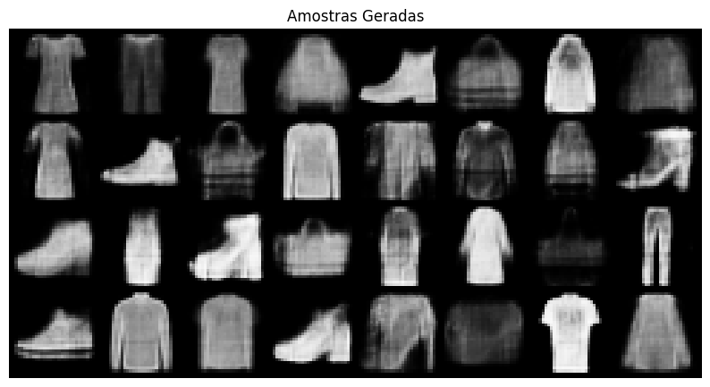
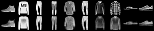
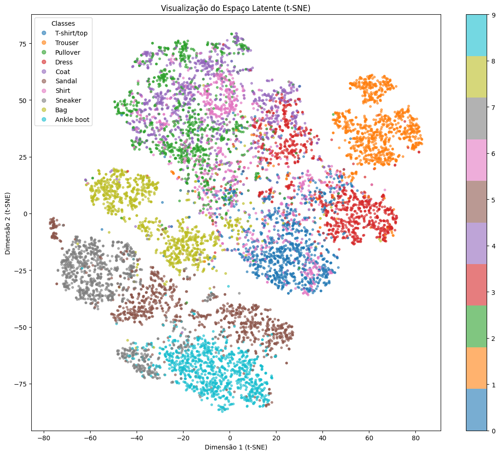

# Redes Neurais - VAE


???+ info inline end "Edição"

    2025.1


## Erik Soares


O objetivo deste roteito é implementar e avaliar um Autocodificador Variacional (VAE) usando o conjunto de dados Fashion MNIST. 

## 1: Preparação dos Dados
- Carregamento do conjunto de dados Fashion MNIST;

- Normalização das imagens para o intervalo [0, 1];

- Divisão do conjunto de dados em conjuntos de treinamento e validação.

Utilizou-se o dataset Fashion MNIST, com 60.000 imagens de treino (divididas em 50k para treino e 10k para validação) e 10k de teste. As imagens foram normalizadas para o intervalo [0, 1].

```python
import torch
from torchvision import datasets, transforms
from torch.utils.data import DataLoader, random_split

# O transforms.ToTensor() automaticamente normaliza os valores dos pixels para [0, 1].
transform = transforms.ToTensor()


# Faz o download e carrega o dataset Fashion MNIST
train_dataset_full = datasets.FashionMNIST(
    root='./data',
    train=True,     # Carrega o conjunto de treino (60k imagens)
    download=True,
    transform=transform
)

test_dataset = datasets.FashionMNIST(
    root='./data',
    train=False,    # Carrega o conjunto de teste (10k imagens)
    download=True,
    transform=transform
)

# Divide o dataset em treino e validação (10k para validação)
train_size = 50000
val_size = len(train_dataset_full) - train_size
train_dataset, val_dataset = random_split(train_dataset_full, [train_size, val_size])

print(f"Tamanho total do dataset de treino original: {len(train_dataset_full)}")
print(f"Tamanho do novo dataset de treino:   {len(train_dataset)}")
print(f"Tamanho do novo dataset de validação: {len(val_dataset)}")
print(f"Tamanho do dataset de teste:          {len(test_dataset)}")


batch_size = 64
train_loader = DataLoader(train_dataset, batch_size=batch_size, shuffle=True)
val_loader = DataLoader(val_dataset, batch_size=batch_size, shuffle=False)
test_loader = DataLoader(test_dataset, batch_size=batch_size, shuffle=False)

# Verificando os valores dos pixels no dataset de treino
data, labels = next(iter(train_loader))
print(f"Valor mínimo do pixel: {data.min()}")
print(f"Valor máximo do pixel: {data.max()}")
```

#### Resumo da Preparação dos Dados
- Tamanho total do dataset de treino original: 60000
- Tamanho do novo dataset de treino:   50000
- Tamanho do novo dataset de validação: 10000
- Tamanho do dataset de teste:          10000
#### Valores dos pixels
Valor mínimo do pixel: 0.0
Valor máximo do pixel: 1.0

## 2: Implementação do VAE
- Definir a arquitetura VAE, incluindo as redes de codificadores e decodificadores;
- Implementação do truque da reparametrização.

Arquitetura: O VAE foi construído com redes neurais densas (Lineares), contendo:

**Encoder:** Mapeou a imagem de entrada (784 pixels) para um espaço latente de 20 dimensões, gerando os vetores mu e log_var.

**Decoder:** Mapeou o vetor latente z (20 dimensões) de volta para a imagem (784 pixels), com uma função de ativação Sigmoid na saída.

```python
import torch.nn as nn

IMAGE_SIZE = 28*28  # Imagens do Fashion MNIST são 28x28 = 784 pixels
HIDDEN_DIM = 400    # Tamanho da camada oculta tanto do encoder quanto do decoder
LATENT_DIM = 20     # Tamanho do espaço latente (z). 


class VAE(nn.Module):
    def __init__(self):
        super(VAE, self).__init__()

        # encoder
        # Multiplica por 2 porque vai gerar 'mu' E 'log_var', 
        self.encoder = nn.Sequential(
            nn.Linear(IMAGE_SIZE, HIDDEN_DIM),
            nn.ReLU(),
            nn.Linear(HIDDEN_DIM, LATENT_DIM * 2) 
        )

        # decoder
        # (Input: LATENT_DIM) -> (Hidden: 400) -> (Output: 784)
        self.decoder = nn.Sequential(
            nn.Linear(LATENT_DIM, HIDDEN_DIM),
            nn.ReLU(),
            nn.Linear(HIDDEN_DIM, IMAGE_SIZE),
            nn.Sigmoid() # Deixa a saída entre 0 e 1
        )

    # Truque da reparametrização
    def reparameterize(self, mu, log_var):
        """
        Esta é a função que implementa o truque z = mu + sigma * epsilon
        """
        # Calcula o desvio padrão a partir do log_var
        std = torch.exp(0.5 * log_var)
        
        # epsilon é um ruído com valor médio 0 e desvio padrão 1
        # torch.randn_like(std) cria um tensor de ruído aleatório 
        eps = torch.randn_like(std)
        
        return mu + eps * std

    def forward(self, x):
        # achata a imagem de entrada
        # x entra com shape [batch_size, 1, 28, 28] e sai com [batch_size, 784]
        x_flat = x.view(-1, IMAGE_SIZE)
        
        # encoder
        h = self.encoder(x_flat)
        
        # obtém 'mu' e 'log_var' dividindo 'h' ao meio
        # ambos saem com shape [batch_size, LATENT_DIM]
        mu, log_var = h.chunk(2, dim=1)
        
        # aplica o truque da reparametrização para obter 'z'
        # z sai com shape [batch_size, LATENT_DIM]
        z = self.reparameterize(mu, log_var)
        
        # passa o 'z' pelo decoder para reconstruir a imagem
        # reconstruction sai com shape [batch_size, 784]
        reconstruction = self.decoder(z)
        
        # retornamos tudo, pq vamos precisar de 'mu' e 'log_var' para calcular a função de perda
        return reconstruction, mu, log_var
```

## 3: Treinamento
- Treinamento do VAE no conjunto de dados Fashion MNIST;
- Monitoramento da perda e geração de reconstruções durante o treinamento.

O modelo foi treinado por 100 épocas, utilizando o otimizador Adam.

**Função de Perda (Loss):** A perda total (ELBO) foi a soma de duas componentes:

**Perda de Reconstrução (BCE):** Binary Cross-Entropy entre a imagem original e a reconstruída. É calculada pixel a pixel, para medir quão bem o VAE consegue reconstruir a imagem de entrada.

**Perda de Regularização (KLD):** A Divergência de Kullback-Leibler, que força a distribuição do espaço latente a se aproximar de uma Normal padrão $N(0, 1)$. Necessário para garantir que o espaço latente seja bem estruturado e contínuo, senão o VAE não conseguiria gerar novas amostras de forma eficaz.

```python
import torch.optim as optim
import torchvision
import os

if not os.path.exists('resultados_treinamento'):
    os.makedirs('resultados_treinamento')
device = torch.device("cuda" if torch.cuda.is_available() else "cpu")

# Instancia o modelo
model = VAE().to(device)

# Define o otimizador Adam
learning_rate = 1e-3 # taxa de aprendizado
optimizer = optim.Adam(model.parameters(), lr=learning_rate)

# Define a parte BCE da nossa função de perda
# Usamos 'reduction="sum"' para somar os erros de todos os pixels
criterion_bce = nn.BCELoss(reduction='sum')

# Função para a parte KLD da perda
def kld_loss_function(mu, log_var):
    KLD = -0.5 * torch.sum(1 + log_var - mu.pow(2) - log_var.exp())
    return KLD

# Pega um lote fixo do conjunto de validação para monitorar as reconstruções
fixed_batch, _ = next(iter(val_loader))
fixed_batch = fixed_batch.to(device)


NUM_EPOCHS = 100 
for epoch in range(NUM_EPOCHS):
    model.train()
    train_loss = 0.0
    
    for i, (data, _) in enumerate(train_loader):
        
        data = data.to(device)
        
        
        # Passa os dados pelo modelo
        reconstrucao, mu, log_var = model(data)
        
        # Calcula a perda
        data_flat = data.view(-1, IMAGE_SIZE) 
        
        loss_bce = criterion_bce(reconstrucao, data_flat)
        loss_kld = kld_loss_function(mu, log_var)
        
        total_loss = loss_bce + loss_kld # A perda total!
        
        # Zera os gradientes antes da backward pass
        optimizer.zero_grad()
        
        # Calcula os gradientes
        total_loss.backward()
        
        # Atualizar os pesos
        optimizer.step()
                
        train_loss += total_loss.item()
        
        # Print da perda a cada 100 lotes
        if (i+1) % 100 == 0:
            print(f'Epoch [{epoch+1}/{NUM_EPOCHS}], '
                  f'Batch [{i+1}/{len(train_loader)}], '
                  f'Loss: {total_loss.item() / len(data):.4f} '
                  f'(BCE: {loss_bce.item() / len(data):.4f}, '
                  f'KLD: {loss_kld.item() / len(data):.4f})')

    # Imprime a média da perda da época
    avg_train_loss = train_loss / len(train_loader.dataset)
    print(f'====> Fim da Epoch: {epoch+1} Média de Perda: {avg_train_loss:.4f}')

    # Gera e salva imagens de reconstrução usando o lote fixo
    model.eval()
    with torch.no_grad():
        reconstrucao_epoca, _, _ = model(fixed_batch)
        
        # Concatena as imagens originais e reconstruídas
        reconstrucao_epoca = reconstrucao_epoca.view(-1, 1, 28, 28).cpu()
        originais = fixed_batch.cpu()
        
        # Pega as primeiras 8 imagens de cada
        comparacao = torch.cat([originais[:8], reconstrucao_epoca[:8]])
        
        # Salva a imagem em um grid
        grid = torchvision.utils.make_grid(comparacao, nrow=8)
        
        # Salva o arquivo
        filepath = f'resultados_treinamento/reconstrucao_epoch_{epoch+1:02d}.png'
        torchvision.utils.save_image(grid, filepath)
        print(f'Imagem de reconstrução salva em: {filepath}')

print("Treinamento concluído!")
```

Com o treinamento é possível observar já na primeira época que as imagens começam a ser reconstruídas de forma adequada, mesmo que com algumas imperfeições. Conforme o número de épocas aumenta, a qualidade das reconstruções melhora em alguns detalhes, mas o modelo já consegue capturar as características principais das imagens desde o início do treinamento, como mostrado nas imagens abaixo.

#### Época 1


#### Época 100


## 4: Avaliação
- Avaliação do desempenho do VAE no conjunto de validação;
- Geração de novas amostras a partir do espaço latente aprendido.

```python
def evaluate_model(model, loader, criterion_bce, kld_loss_fn, device):
    """
    Função para avaliar o modelo em um determinado conjunto de dados (loader).
    """
    model.eval()
    val_loss = 0.0
    
    with torch.no_grad():
        for i, (data, _) in enumerate(loader):
            data = data.to(device)
            
            # Forward pass
            reconstrucao, mu, log_var = model(data)
            
            # Calcular a perda
            data_flat = data.view(-1, IMAGE_SIZE)
            loss_bce = criterion_bce(reconstrucao, data_flat)
            loss_kld = kld_loss_fn(mu, log_var)
            
            total_loss = loss_bce + loss_kld
            val_loss += total_loss.item()
            
    # Calcula a perda média por imagem
    avg_val_loss = val_loss / len(loader.dataset)
    print(f"Perda (Loss) Média Total na Validação: {avg_val_loss:.4f}")
    return avg_val_loss

final_val_loss = evaluate_model(model, val_loader, criterion_bce, kld_loss_function, device)
```
- Perda (Loss) Média Total na Validação: 240.0858

```python
import matplotlib.pyplot as plt
import numpy as np

def generate_samples(model, num_samples, device, latent_dim):
    """
    Gera 'num_samples' novas imagens a partir do espaço latente.
    """
    model.eval()
    
    with torch.no_grad():
        z_aleatorio = torch.randn(num_samples, latent_dim).to(device)
        
        # Passa 'z' aleatório somente pelo decoder
        novas_imagens_flat = model.decoder(z_aleatorio)
        
        # Remodela para formato de imagem [num_samples, 1, 28, 28]
        novas_imagens = novas_imagens_flat.view(-1, 1, 28, 28).cpu()
        
        grid = torchvision.utils.make_grid(novas_imagens, nrow=8) # 8 imagens por linha
        
        plt.figure(figsize=(10, 10))
        plt.imshow(np.transpose(grid, (1, 2, 0)), cmap='gray')
        plt.title(f"Amostras Geradas")
        plt.axis('off')
        plt.show()

NUM_AMOSTRAS_PARA_GERAR = 32
generate_samples(model, NUM_AMOSTRAS_PARA_GERAR, device, LATENT_DIM)
```


## 5: Visualização
- Visualização de imagens originais e reconstruídas;

```python
# Pegar um lote de dados de teste
final_batch, _ = next(iter(test_loader))
final_batch = final_batch.to(device)

model.eval()
with torch.no_grad():
    # Passa o lote pelo modelo treinado
    reconstrucao_final, _, _ = model(final_batch)

reconstrucao_final = reconstrucao_final.view(-1, 1, 28, 28).cpu()
originais = final_batch.cpu()

comparacao = torch.cat([originais[:10], reconstrucao_final[:10]])

# Salva a imagem em um grid
filepath = 'reconstrucao_teste_final.png'
torchvision.utils.save_image(comparacao, filepath, nrow=10)
```


- Visualização do espaço latente utilizando t-SNE.

```python
from sklearn.manifold import TSNE

def visualize_latent_space(model, loader, device):
    """
    Passa todos os dados do 'loader' pelo ENCODER,
    reduz a dimensionalidade com t-SNE e plota o resultado.
    """

    model.eval()
    
    all_latents = []
    all_labels = []

    with torch.no_grad():
        for i, (data, labels) in enumerate(loader):
            data = data.to(device)
            
            # Passa os dados pelo modelo
            reconstrucao, mu, log_var = model(data)
            
            # Guardamos o 'mu' (o centro da nuvem)
            all_latents.append(mu.cpu())
            all_labels.append(labels.cpu())

    # Concatena todos os lotes em um tensor
    latents_tensor = torch.cat(all_latents, dim=0).numpy()
    labels_tensor = torch.cat(all_labels, dim=0).numpy()
    
    tsne = TSNE(n_components=2,
                max_iter=1000,
                verbose=1)
    
    tsne_results = tsne.fit_transform(latents_tensor)
    
    class_names = [
        'T-shirt/top', 'Trouser', 'Pullover', 'Dress', 'Coat',
        'Sandal', 'Shirt', 'Sneaker', 'Bag', 'Ankle boot'
    ]

    plt.figure(figsize=(12, 10))
    
    # Colore cada ponto de acordo com seu label
    scatter = plt.scatter(tsne_results[:, 0],
                          tsne_results[:, 1],
                          c=labels_tensor,
                          cmap='tab10',
                          alpha=0.6,
                          s=10)

    plt.title('Visualização do Espaço Latente (t-SNE)')
    plt.xlabel('Dimensão 1 (t-SNE)')
    plt.ylabel('Dimensão 2 (t-SNE)')
    
    handles, _ = scatter.legend_elements()
    plt.legend(handles, class_names, title="Classes")
    
    plt.colorbar(scatter, ticks=range(10))
    plt.tight_layout()
    plt.show()

visualize_latent_space(model, test_loader, device)
```


### Conclusão e Análise do Espaço Latente (t-SNE)

O gráfico nos permite tirar duas conclusões principais:

1. O Espaço Latente é Organizado (Não Aleatório): O resultado mais óbvio é que os pontos não estão misturados aleatoriamente. Em vez disso, formam-se 10 clusters distintos, cada um correspondendo a uma das 10 classes do Fashion MNIST, mostrando que o VAE aprendeu a "mapear" imagens de entrada para regiões específicas do espaço latente de 20 dimensões.

2. O Modelo Agrupou Itens por Similaridade: O modelo conseguiu separar e agrupar os itens de acordo com a sua similaridade, a exemplo dos sapatos, as classes "Ankle boot" (azul claro), "Sneaker" (amarelo) e "Sandal" (cinza) formam uma grande "região" de calçados. Elas estão separadas em seus próprios clusters, mas estão muito mais próximas umas das outras do que de qualquer outra classe.

Já as roupas, a parte superior do gráfico contém um aglomerado maior e mais difuso das classes "T-shirt/top" (azul), "Pullover" (verde), "Coat" (roxo) e "Shirt" (rosa). Elas estão mais misturadas, o que faz sentido, já que são visualmente mais parecidas entre si do que um sapato.


Obs: Partes desse relatório foram gerados com o auxílio de IA.